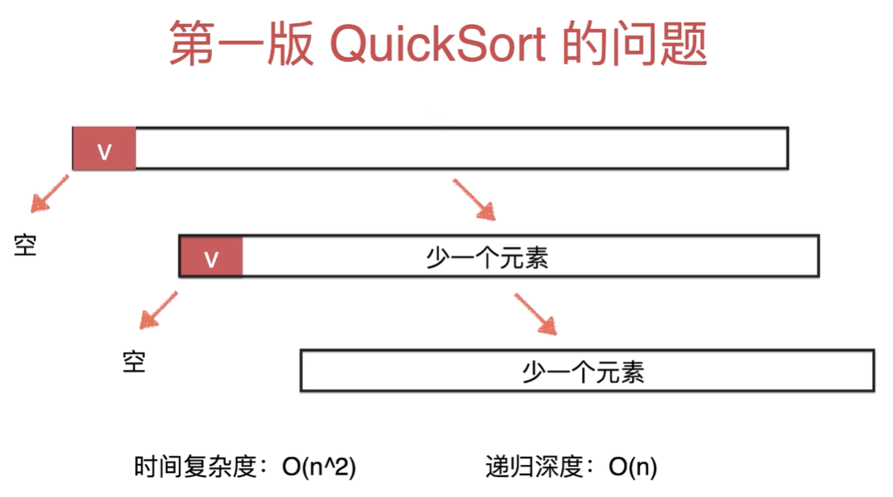
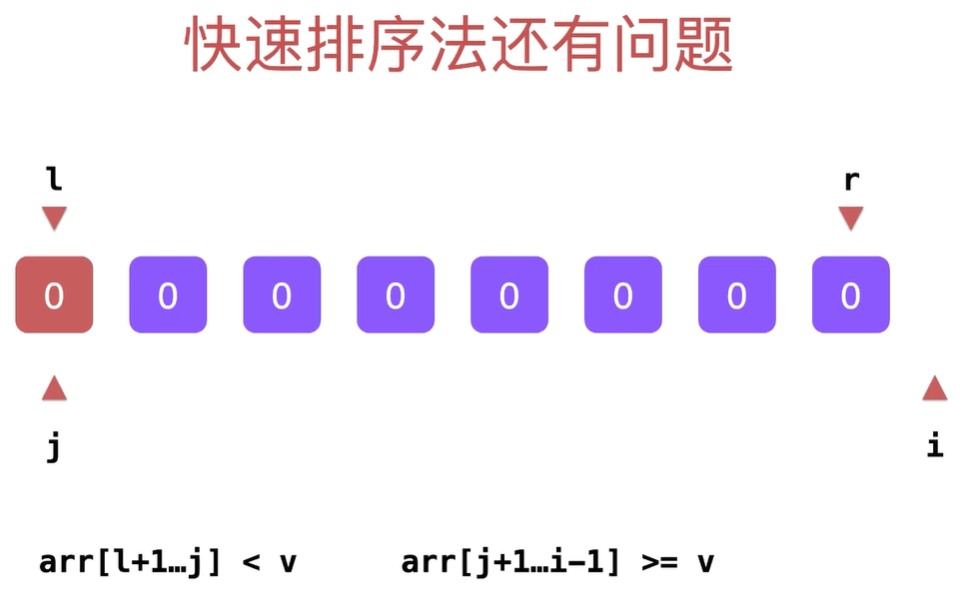

## 快速排序

### 单路快速排序

排序思路：**选取数组的第一个元素作为基准，然后从基准的下一个元素（第二个元素）开始，遍历整个数组**。

有数组 `arr` 如下：

```
   l                                         r
   ↓                                         ↓
╭─────┬─────┬─────┬─────┬─────┬─────┬─────┬─────╮
│  4  │  6  │  2  │  3  │  1  │  5  │  7  │  8  │
╰─────┴─────┴─────┴─────┴─────┴─────┴─────┴─────╯
```

以第一个元素作为基准（pivot），定义循环不变量如下：

```
arr[l + 1, j] <  pivot
arr[j + 1, i] >= pivot
```

其含义是：在 `[l + 1, j]` 区间内，存放小于基准元素的元素；在 `[j + 1, i]` 区间内，存放大于基准元素的元素。

根据上述约定，第一次排序的倒数第二步的结果如下：

```
   l                                         r
   ↓                                         ↓
╭─────┬─────┬─────┬─────┬─────┬─────┬─────┬─────╮
│  4  │  2  │  3  │  1  │  6  │  5  │  7  │  8  │
╰─────┴─────┴─────┴─────┴─────┴─────┴─────┴─────╯
         ↑           ↑     ↑                 ↑
        l+1          j    j+1                i
         ╰────┬──────╯     ╰────────┬────────╯
           < pivot              >= pivot
```

然后基准元素和中间元素（`arr[j]`）交换，得到第一次排序后的结果：

```
╭─────┬─────┬─────┬─────┬─────┬─────┬─────┬─────╮
│  1  │  2  │  3  │  4  │  6  │  5  │  7  │  8  │
╰─────┴─────┴─────┴─────┴─────┴─────┴─────┴─────╯
```

根据定义好的循环不变量，可以写出 `partition` 函数如下：

```js
function partition(arr, l, r) {
  // 直接用第一个元素作为基准（pivot）
  let j = l;

  // 从 pivot 的下一个元素开始，遍历整个数组
  for (let i = l + 1; i <= r; i++) {
    if (arr[i] < arr[l]) {
      j++;
      swap(arr, i, j);
    }
  }

  // 基准元素和中间元素交换
  swap(arr, l, j);

  // 返回中间元素的位置
  return j;
}
```

完整的代码如下：

```js
function swap(arr, i, j) {
  const temp = arr[i];
  arr[i] = arr[j];
  arr[j] = temp;
}

function partition(arr, l, r) {
  let j = l;

  for (let i = l + 1; i <= r; i++) {
    if (arr[i] < arr[l]) {
      j++;
      swap(arr, i, j);
    }
  }

  swap(arr, l, j);

  return j;
}

function quickSort(arr, l = 0, r = arr.length - 1) {
  if (l >= r) return;

  const mid = partition(arr, l, r);

  quickSort(l, mid - 1);
  quickSort(mid + 1, r);
}

let arr = [4, 6, 2, 3, 1, 5, 7, 8];

quickSort(arr);
console.log(arr); // [1, 2, 3, 4, 6, 5, 7, 8]
```

> 第一版快速排序代码和测试代码见：[快速排序算法（第一版）](./source/quicksort/quicksort1.js)

理论上，快排的平均时间复杂度是 O(NlogN)，平均递归深度是 O(logN)。但**当数据完全有序时，单路快排的时间复杂度会退化到 O(N²)，递归深度退化到 O(N)**。所以算法退化后，不仅计算时间变长，而且会引起 Stack Overflow。

### 随机选取基准元素

上述的快排实现中，为了简单起见，我们直接用数组中的第一个元素作为基准元素。当数组中的数据完全有序时，这种方式就会使得算法退化。如下图所示：



> 图片来源：https://www.imooc.com/video/22079

对于这个问题，解决办法是：**随机选取基准元素**。改造后的 `partition` 函数如下：

```diff
  function partition(arr, l, r) {
+   // 随机生成一个 [0, r - l] 之间的数
+   let rnd = l + Math.floor(Math.random() * (r - l + 1);
+   swap(arr, l, rnd);

    let j = l;

    for (let i = l + 1; i <= r; i++) {
      if (arr[i] < arr[l]) {
        j++;
        swap(arr, i, j);
      }
    }

    swap(arr, l, j);

    return j;
  }
```

> 第二版快速排序代码和测试代码见：[快速排序算法（第二版）](./source/quicksort/quicksort2.js)

这样改造之后，再处理完全有序的数据就没有问题了。然而还是存在其他问题：**当数组元素全都相同时，算法再一次退化**。如下图所示：



> 图片来源：https://www.imooc.com/video/22075

### 双路快速排序

由上图可以看到，当数组元素全部相同时，每次遍历后，基准元素都分布在数组的一端，从而导致算法不再遵循二分思想，退化到 O(N²)。

解决这个问题的思路是，想办法将基准元素放在中间，也就是尽可能的把元素均摊在基准元素两边，从而最大的发挥二分思想的优势。

代码思路也很简单，我们只需将原来“从一端向另一端遍历”改为“从两端向中间遍历”。具体的 `partition` 代码如下：

```js
function partition(arr, l, r) {
  // 随机选取 [0, r - l] 之间的数
  const rnd = l + Math.floor(Math.random() * (r - l + 1));
  swap(arr, l, rnd);

  let i = l + 1;
  let j = r;

  while (true) {
    while (i <= j && arr[i] < arr[l]) i++;
    while (i <= j && arr[j] > arr[l]) j--;

    if (i >= j) break;

    swap(arr, i, j);
    i++;
    j--;
  }

  swap(arr, l, j);

  return j;
}
```

> 第三版快速排序代码和测试代码见：[快速排序算法（第三版）](./source/quicksort/quicksort3.js)

其中，最关键的点是：

```js
while (i <= j && arr[i] < arr[l]) i++;
while (i <= j && arr[j] > arr[l]) j--;
```

不能写成：

```js
while (i <= j && arr[i] <= arr[l]) i++;
while (i <= j && arr[j] >= arr[l]) j--;
```

试想一下，如果写成带等号的，当数组的所有元素都相等时，`while (i <= j && arr[i] <= arr[l]) i++;` 会直接遍历完整个数组，使得 `pivot` 分布在数组一端，算法退化。这种错误的写法在网上很多博客中都有出现，那些错误的博客根本没有理解快排，不懂快排为什么那样写，怎样写会使得快排退化。

以上，快排的实现就比较完整了，并且**再也找不出一组测试用例，使得算法退化**。

### 复杂度分析

如果你之前有了解过快排，应该会知道，理论上快排最坏的时间复杂度为 O(N²)，平均时间复杂度为 O(NlogN)。最大递归深度 O(N)，平均递归深度 O(logN)。

但是本文中，我们实现的快速排序算法引入了随机化，并不能按照以往的思路去分析其复杂度。

对于分析算法的复杂度，我们有以下两种思路：

- 随机算法：没有一组数据能 100% 使算法退化。看期望。
- 非随机算法：能找到一组数据 100% 使算法退化。看最差。

经过上文的分析可知，我们实现的快排使用了随机算法，找不到任何一组数据使得算法退化，因此需要看算法的期望。

如何通过期望来求复杂度，严谨的推导过程可以参考《算法导论》中的快排，本文不再提及。

对于算法的期望，可以简单的理解为平均（只是这么理解，不准确）。最后可以得出，我们实现的算法，时间复杂度（的期望值）是 O(NlogN)，递归深度（的期望值）是 O(logN)。

### 三路快速排序

三路快速排序的思路很简单，就是在之前的基础上，把数组分为 `< v`、`== v`、`> v` 的三部分：

> 第一个元素作为基准（pivot）

```
╭───┬───────────────┬────────────────────────────────────┬──────────────╮
│ v │      < v      │                == v                │     > v      │
╰───┴───────────────┴────────────────────────────────────┴──────────────╯
  ↑                                                                   ↑
  l                                                                   r
```

下图是三路快排的某次中间结果：

```
╭───┬───────────────┬──────┬───┬─────────────────────────┬──────────────╮
│ v │      < v      │ == v │ e │                         │     > v      │
╰───┴───────────────┴──────┴───┴─────────────────────────┴──────────────╯
  ↑               ↑          ↑                             ↑          ↑
  l               lt         i                             gt         r
```

我们用 `lt` 指向 `< v` 的最后一个元素的索引，用 `gt` 指向 `> v` 的第一个元素的索引。用 `i` 作为循环变量，此时指向元素 `e`。

对于元素 `e` 的处理，分为以下三种情况：

- 当 `e` 等于 `v` 时。直接归入 `== v` 的部分，代码实现很简单，直接 `i++`。
- 当 `e` 小于 `v` 时。交换 `arr[i]` 和 `arr[lt + 1]`，就可以将元素 `e` 归入 `< v` 的部分，然后维护下变量 `lt++`, `i++`。
- 当 `e` 大于 `v` 时。交换 `arr[i]` 和 `arr[gt - 1]`，就可以将元素 `e` 归入 `> v` 的部分，此时变量 `i` 并不用维护（因为 `gt - 1` 处的元素还没有判断过）。

当遍历结束时，得到如下结果：

```
╭───┬─────────────────────┬────────────────────┬────────────────────────╮
│ v │      < v            │          == v      │               > v      │
╰───┴─────────────────────┴────────────────────┴────────────────────────╯
  ↑                     ↑                        ↑                    ↑
  l                     lt                       gt                   r
                                                 ↑
                                                 i
```

此时 `i` 指向 `gt`，因此判断循环结束的条件很简单，就是 `i === gt` 时。通过以上分析，定义循环不变量如下：

```
arr[ l + 1 , lt    ]  < v
arr[ lt + 1, i - 1 ] == v
arr[ gt    , r     ]  > v
```

根据定义好的循环不变量，三路快排实现如下：

```js
function partition(arr, l, r) {
  // 随机选取 [0, r - l] 之间的数
  const rnd = l + Math.floor(Math.random() * (r - l + 1));
  swap(arr, l, rnd);

  let lt = l;
  let gt = r + 1;
  let i = l + 1;

  while (i < gt) {
    if (arr[i] < arr[l]) {
      lt++;
      swap(arr, i, lt);
      i++;
    } else if (arr[i] > arr[l]) {
      gt--;
      swap(arr, i, gt);
    } else {
      i++;
    }
  }

  swap(arr, l, lt);

  // 注意这里 arr[l] 和 arr[lt] 交换后，lt 应该向前移动一位
  return { lt: lt - 1, gt };
}

function quickSort(arr, l = 0, r = arr.length - 1) {
  if (l >= r) return;

  const { lt, gt } = partition(arr, l, r);
  quickSort(arr, l, lt);
  quickSort(arr, gt, r);
}
```

> 第四版快速排序代码和测试代码见：[快速排序算法（第四版）](./source/quicksort/quicksort4.js)

### V8 中的快排实现（旧版）

源码地址：https://github.com/v8/v8/blob/ad82a40509c5b5b4680d4299c8f08d6c6d31af3c/src/js/array.js#L726-L844

```js
var GetThirdIndex = function (a, from, to) {
  var t_array = new InternalArray();
  // Use both 'from' and 'to' to determine the pivot candidates.
  // liuyib 注：任何和 15 按位与的结果都会小于或者等于 15，这里是为了每隔 200 ~ 215 个元素取一个值
  var increment = 200 + ((to - from) & 15);
  var j = 0;
  from += 1;
  to -= 1;
  for (var i = from; i < to; i += increment) {
    t_array[j] = [i, a[i]];
    j++;
  }
  t_array.sort(function (a, b) {
    return comparefn(a[1], b[1]);
  });
  var third_index = t_array[t_array.length >> 1][0];
  return third_index;
};

var QuickSort = function QuickSort(a, from, to) {
  var third_index = 0;
  while (true) {
    // Insertion sort is faster for short arrays.
    if (to - from <= 10) {
      InsertionSort(a, from, to);
      return;
    }
    if (to - from > 1000) {
      third_index = GetThirdIndex(a, from, to);
    } else {
      // liuyib 注：num >> 1 等价于 Math.floor(num / 2);
      third_index = from + ((to - from) >> 1);
    }
    // Find a pivot as the median of first, last and middle element.
    var v0 = a[from];
    var v1 = a[to - 1];
    var v2 = a[third_index];
    var c01 = comparefn(v0, v1);
    if (c01 > 0) {
      // v1 < v0, so swap them.
      var tmp = v0;
      v0 = v1;
      v1 = tmp;
    } // v0 <= v1.
    var c02 = comparefn(v0, v2);
    if (c02 >= 0) {
      // v2 <= v0 <= v1.
      var tmp = v0;
      v0 = v2;
      v2 = v1;
      v1 = tmp;
    } else {
      // v0 <= v1 && v0 < v2
      var c12 = comparefn(v1, v2);
      if (c12 > 0) {
        // v0 <= v2 < v1
        var tmp = v1;
        v1 = v2;
        v2 = tmp;
      }
    }
    // v0 <= v1 <= v2
    a[from] = v0;
    a[to - 1] = v2;
    var pivot = v1;
    var low_end = from + 1; // Upper bound of elements lower than pivot.
    var high_start = to - 1; // Lower bound of elements greater than pivot.
    a[third_index] = a[low_end];
    a[low_end] = pivot;

    // From low_end to i are elements equal to pivot.
    // From i to high_start are elements that haven't been compared yet.
    partition: for (var i = low_end + 1; i < high_start; i++) {
      var element = a[i];
      var order = comparefn(element, pivot);
      if (order < 0) {
        a[i] = a[low_end];
        a[low_end] = element;
        low_end++;
      } else if (order > 0) {
        do {
          high_start--;
          if (high_start == i) break partition;
          var top_elem = a[high_start];
          order = comparefn(top_elem, pivot);
        } while (order > 0);
        a[i] = a[high_start];
        a[high_start] = element;
        if (order < 0) {
          element = a[i];
          a[i] = a[low_end];
          a[low_end] = element;
          low_end++;
        }
      }
    }
    if (to - high_start < low_end - from) {
      QuickSort(a, high_start, to);
      to = low_end;
    } else {
      QuickSort(a, from, low_end);
      from = high_start;
    }
  }
};
```

> 其中，排序采用的算法跟数组的长度有关，当数组长度小于等于 10 时，采用插入排序，大于 10 的时候，采用快速排序。(当然了，这种说法并不严谨)。这里只讨论其中的快排部分。

选择合适的基准元素（pivot）对 QuickSort 的性能有着很大的影响。V8 采用了两条策略：

找到数组中的第一个，最后一个和“第三个”元素，然后选择这三个元素的中间值作为 pivot。对于较短数组，“第三个”元素就是中间的元素。
对于较长的数组，从其中抽出一个较小的子数组进行排序，并将排序后数组中间的元素作为“第三个”元素。

V8 中，计算“第三个元素”位置有两种方法：

1. 数据大于 1000 时，根据一定间隔（例如 200）取出数组元素，组成新的较短的数组（较短的数组中，要保存元素原来的索引），然后获取较短数组中，中间元素原来的索引。
2. 数据小于 1000 时，取中间的元素。
