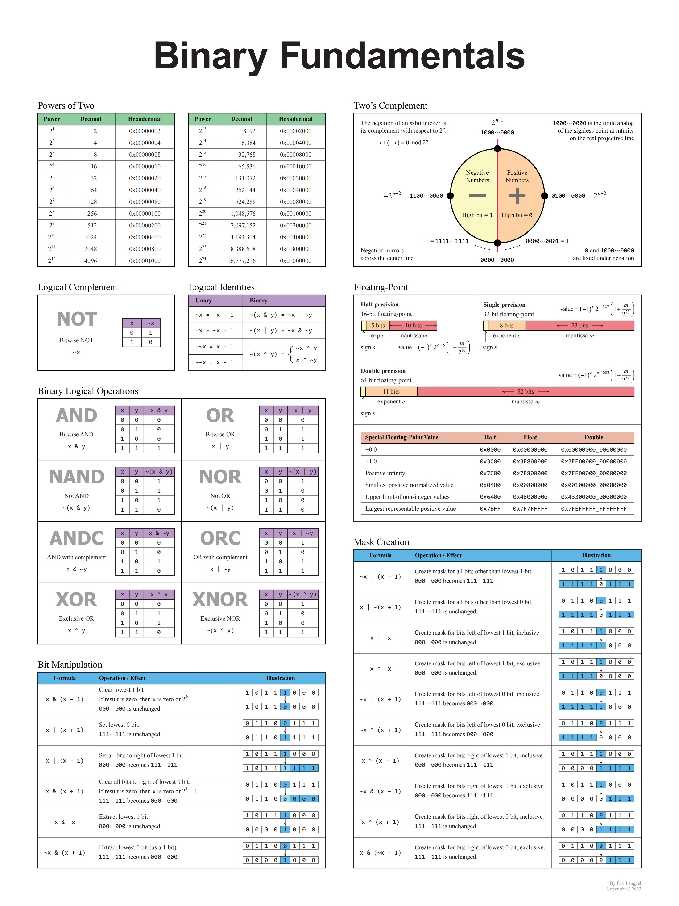

- [位运算](#位运算)
  - [二进制数转十进制](#二进制数转十进制)
    - [从二进制高位依次输入](#从二进制高位依次输入)
    - [从二进制低位依次输入](#从二进制低位依次输入)

# 位运算



## 二进制数转十进制

### 从二进制高位依次输入

举例：`10110` -> `22`

```js
// 二进制的各个位数（从高位到低位）
const bits = [1, 0, 1, 1, 0];
let ans = 0;

for (let i = 0; i < bits.length; i++) {
  const bit = bits[i];

  ans = (ans << 1) | bit;
  // 该步骤过程如下：
  // 0 左移一位变为 00，或 1 运算后变为 01
  // 01 左移一位变为 010，或 0 运算后变为 010
  // 010 左移一位变为 0100，或 1 运算后变为 0101
  // 0101 左移一位变为 01010，或 1 运算后变为 01011
  // 01011 左移一位变为 010110，或 0 运算后变为 010110
  // 结果为 22
}
```

### 从二进制低位依次输入

举例：`10110` -> `22`

```js
// 二进制的各个位数（从低位到高位）
const bits = [0, 1, 1, 0, 1];
let ans = 0;

for (let i = 0; i < bits.length; i++) {
  const bit = bits[i];

  // TODO: 暂时不知道怎么算
}
```
