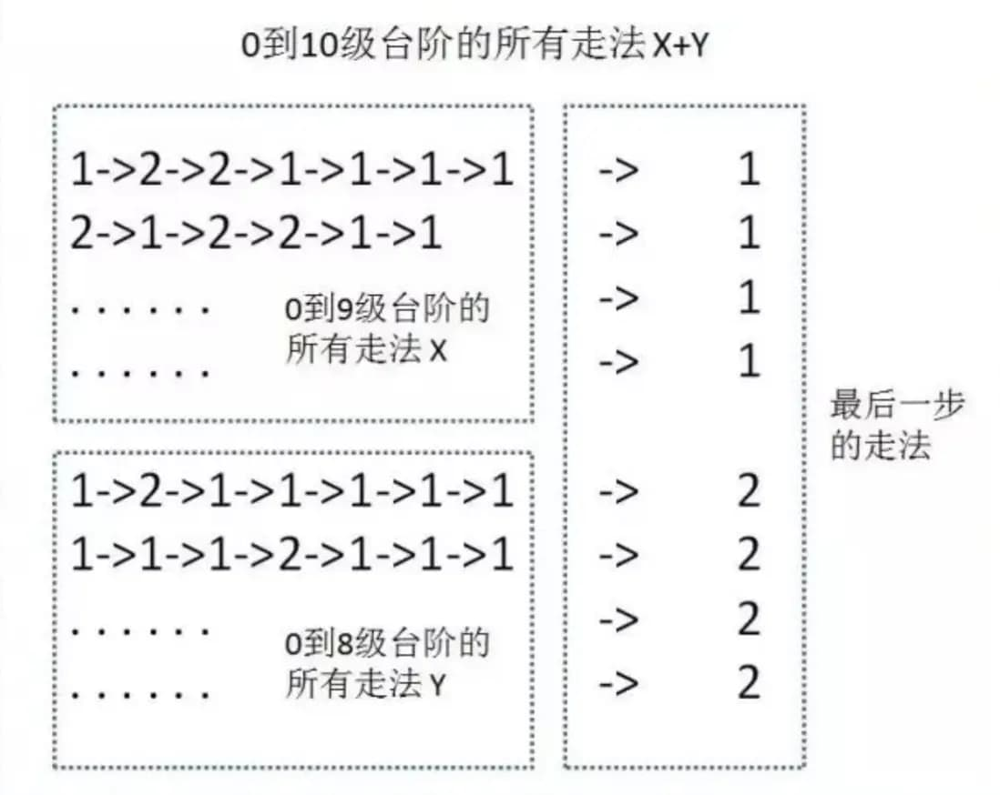

> 本文档中加 ⭐ 的题目表示比较经典，可以作为例题。

# 动态规划

将原问题拆解成若干子问题，同时保存子问题的答案，使得每个子问题只求解一次，最终获得原问题的答案。

## 斐波那契数列

```
f(0) = 0
f(1) = 1
f(n) = f(n - 1) + f(n - 2)
```

```js
function fib(n) {
  if (n === 0 || n === 1) return n;

  return fib(n - 1) + fib(n - 2);
}
```

使用“记忆化搜索”优化（**自上而下**的解决问题）：

```js
const memo = new Map();

function fib(n) {
  if (n === 0 || n === 1) return n;

  if (!memo.has(n)) {
    memo.set(n, fib(n - 1) + fib(n - 2));
  }

  return memo.get(n);
}
```

使用动态规划优化（**自下而上**的解决问题）：

```js
function fib(n) {
  const memo = new Map();

  memo.set(0, 0);
  memo.set(1, 1);

  for (let i = 2; i <= n; i++) {
    memo.set(i, memo.get(i - 1) + memo.get(i - 2));
  }

  return memo.get(n);
}
```

## 题目推荐

- [70. 爬楼梯](https://leetcode.cn/problems/climbing-stairs/) ⭐（1. 递归+memo（自己会做）。2. DP）
- [343. 整数拆分](https://leetcode.cn/problems/integer-break/)（自己会做。递归+DP 比较简单。循环+DP 太难了，数学方法也难）
- [120. 三角形最小路径和](https://leetcode.cn/problems/triangle/)（看了题解，自己有思路（和题解一致），但是不会写）
- [64. 最小路径和](https://leetcode.cn/problems/minimum-path-sum/)（自己会做。DP+状态压缩。1. 自下向上解（边界写起来麻烦）。2. 自上向下解，边界好写）
- [279. 完全平方数](https://leetcode.cn/problems/perfect-squares/)
- [91. 解码方法](https://leetcode.cn/problems/decode-ways/)（1. 递归+memo（自己会做）。2. DP（看了题解））
- [62. 不同路径](https://leetcode.cn/problems/unique-paths/)
- [63. 不同路径 II](https://leetcode.cn/problems/unique-paths-ii/)
- [96. 不同的二叉搜索树](https://leetcode.cn/problems/unique-binary-search-trees/)
- [834. 树中距离之和](https://leetcode.cn/problems/sum-of-distances-in-tree/)
- [968. 监控二叉树](https://leetcode.cn/problems/binary-tree-cameras/)

## 题目详解

> 以下题全部来源于“题目推荐”，这里给出详解。

- [70. 爬楼梯](https://leetcode.cn/problems/climbing-stairs/)

  ```js
  var climbStairs = function (n) {
    const dp = new Array(n + 1).fill(0);

    dp[0] = 1;
    dp[1] = 1;

    for (let i = 2; i <= n; ++i) {
      dp[i] = dp[i - 1] + dp[i - 2];
    }

    return dp[n];
  };
  ```

  和斐波那契的 DP 代码一样，但是如何理解？

  因为一次可以爬 1 层或 2 层，所以爬到第 10 层只能是从 8、9 层上来的。所以从第 8 层上来的所有方法，加上从第 9 层上来的所有方法，就是全部的方法。如下图：

  

- [91. 解码方法](https://leetcode.cn/problems/decode-ways/)

  > 「爬楼梯」的变种题型

  ```js
  var numDecodings = function (s) {
    const len = s.length;
    const dp = new Array(len + 1).fill(0);

    dp[0] = 1;

    for (let i = 1; i <= len; i++) {
      // 相当于爬楼梯中，一次爬一步
      if (s[i - 1] !== '0') {
        dp[i] += dp[i - 1];
      }
      // 相当于爬楼梯中，一次爬两步
      if (
        i > 1 &&
        s[i - 2] !== '0' &&
        Number(s[i - 2]) * 10 + Number(s[i - 1]) <= 26
      ) {
        dp[i] += dp[i - 2];
      }
    }

    return dp[len];
  };
  ```
