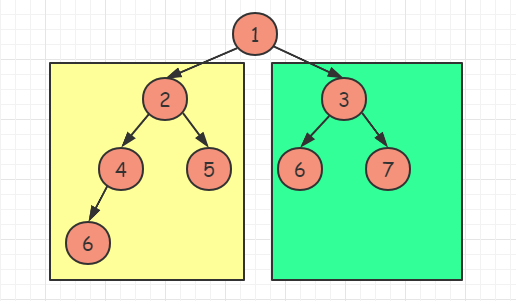

- [树](#树)
  - [二叉树](#二叉树)
    - [二叉树分类](#二叉树分类)
    - [二叉树的表示](#二叉树的表示)
    - [二叉树遍历](#二叉树遍历)
      - [前中后序遍历的递归解法](#前中后序遍历的递归解法)
      - [前中后序遍历的非递归解法](#前中后序遍历的非递归解法)
    - [DFS](#dfs)
    - [BFS](#bfs)
    - [Morris 遍历](#morris-遍历)
    - [二叉树构建](#二叉树构建)
  - [三种题型](#三种题型)
    - [搜索题型](#搜索题型)
    - [构建题型](#构建题型)
    - [修改题型](#修改题型)
  - [四个重要概念](#四个重要概念)
    - [完全二叉树](#完全二叉树)
    - [满二叉树](#满二叉树)
    - [二叉搜索树](#二叉搜索树)
    - [路径](#路径)
    - [距离](#距离)
  - [一些技巧](#一些技巧)
    - [双递归](#双递归)
    - [转换为连通图](#转换为连通图)
    - [递归透传多个节点](#递归透传多个节点)
    - [前序？后序？](#前序后序)
    - [虚拟节点](#虚拟节点)
    - [扩展参数](#扩展参数)
    - [返回数组/对象](#返回数组对象)
  - [练习题目](#练习题目)

# 树

## 二叉树

### 二叉树分类

- 完全二叉树
- 满二叉树
- 二叉搜索树
- [平衡二叉树](https://github.com/azl397985856/leetcode/blob/master/thinkings/balanced-tree.md)
- 红黑树
- 。。。

### 二叉树的表示

- 链表存储
- 数组存储。非常适合**完全二叉树**

### 二叉树遍历

1. 前序遍历
2. 中序遍历
3. 后序遍历
4. 层序遍历

#### 前中后序遍历的递归解法

略

#### 前中后序遍历的非递归解法

- 统一思路 1：使用标记元素

  代码示例，前序遍历（中序、后序类似）：

  ```js
  const preOrder = function (root) {
    const FLAG = '#';
    const nodes = [root];
    const ans = [];

    while (nodes.length) {
      const node = nodes.pop();

      if (!node) continue;
      if (node !== FLAG) {
        nodes.push(node.right);
        nodes.push(node.left);

        // 中序、后序遍历把这两行代码换位置就行
        nodes.push(node);
        nodes.push(FLAG);
      } else {
        ans.push(nodes.pop());
      }
    }

    return ans;
  };
  ```

- 统一思路 2：双色标记法

  垃圾回收算法中，有一种算法叫三色标记法。 即：

  - 用白色表示尚未访问
  - 灰色表示尚未完全访问子节点
  - 黑色表示子节点全部访问

  那么我们可以模仿其思想，使用双色标记法来统一实现三种遍历。其核心思想如下：

  - 白色表示新节点
  - 灰色表示已访问的节点
  - 遇到白色节点，将其标记为灰色，然后“自身、左节点、右节点”按需依次入栈
  - 遇到节点灰色，将其值输出

  代码示例，前序遍历（中序、后序类似）：

  ```js
  const preOrder = function (root) {
    const WHITE = 0;
    const GRAY = 1;
    const nodes = [[root, WHITE]];
    const ans = [];

    while (nodes.length) {
      const [node, color] = nodes.pop();

      if (!node) continue;
      if (color === GRAY) {
        ans.push(node.val);
      } else {
        nodes.push([node.right, WHITE]);
        nodes.push([node.left, WHITE]);
        nodes.push([node, GRAY]);
      }
    }

    return ans;
  };
  ```

- [144. 二叉树的前序遍历](https://leetcode.cn/problems/binary-tree-preorder-traversal/)
- [94. 二叉树的中序遍历](https://leetcode.cn/problems/binary-tree-inorder-traversal/)
- [145. 二叉树的后序遍历](https://leetcode.cn/problems/binary-tree-postorder-traversal/)

### DFS

略

### BFS

BFS 适合求 **最短问题（距离/路径）** 或 **某一个距离的目标**。

两种解题套路：

- 不标记层

  略

- 标记层

  ```js
  const bfs = function (root, k) {
    const queue = [root];
    const result = [];
    // 标记第几层
    let level = 0;

    while (queue.length) {
      for (let i = 0; i < queue.length; i++) {
        const node = queue.shift();

        if (level === k) result.push(node.val);
        if (node.left) queue.push(node.left);
        if (node.right) queue.push(node.right);
      }

      level++;
    }

    return result;
  };
  ```

### Morris 遍历

**Morris 遍历可以不使用递归也不借助于栈，实现 `O(1)` 空间遍历一颗二叉树**。

这个算法考察相对少，作为了解即可。

```js
const morrisTraversal = function (root) {
  curr = root;

  while (curr) {
    // If left child is null, print the
    // current node data. And, update
    // the current pointer to right child.
    if (curr.left) {
      console.log(curr.data);
      curr = curr.right;
    } else {
      // Find the inorder predecessor
      prev = curr.left;

      while (prev.right && prev.right) {
        prev = prev.right;

        // If the right child of inorder
        // predecessor already points to
        // the current node, update the
        // current with it's right child
        if (prev.right === curr) {
          prev.right = null;
          curr = curr.right;
        } else {
          // else If right child doesn't point
          // to the current node, then print this
          // node's data and update the right child
          // pointer with the current node and update
          // the current with it's left child
          console.log(curr.data);
          prev.right = curr;
          curr = curr.left;
        }
      }
    }
  }
};
```

### 二叉树构建

**中序序列**和**前、后、层序列**任意组合唯一确定一颗二叉树（前提是遍历是**基于引用**的或者二叉树的**值都不相同**）。**前、后、层序列**都是提供根结点的信息，**中序序列**用来区分左右子树。

> 单前/中/后序遍历是无法确定一棵树。

实际上构造一棵树的本质是：

1. 确定根节点
2. 确定其左子树
3. 确定其右子树

比如拿到前序遍历和中序遍历，在前序遍历我们可以能确定树根 root，拿到 root 可以将中序遍历切割中左右子树。这样就可以确定并构造一棵树，整个过程我们可以用递归完成。详情见 [构建二叉树专题](https://github.com/azl397985856/leetcode/blob/master/selected/construct-binary-tree.md)

## 三种题型

### 搜索题型

- [113. 路径总和 II](https://leetcode.cn/problems/path-sum-ii/) - 参数扩展（一遍过，DFS、BFS）
- [1372. 二叉树中的最长交错路径](https://leetcode.cn/problems/longest-zigzag-path-in-a-binary-tree/description/) - 参数扩展（看了题解，DFS、动规）
- [886. 可能的二分法](https://leetcode.cn/problems/possible-bipartition/description/) - 不会（染色法（DFS/BFS）、并查集）

### 构建题型

- 普通二叉树的构建

  - 根据 DFS 结果（前/中/后序遍历）构建二叉树

    - [105. 从前序与中序遍历序列构造二叉树](https://leetcode.cn/problems/construct-binary-tree-from-preorder-and-inorder-traversal/)（看了题解，递归、迭代）
    - [106. 从中序与后序遍历序列构造二叉树](https://leetcode.cn/problems/construct-binary-tree-from-inorder-and-postorder-traversal/)（上面会了后，这个一遍过）
    - [889. 根据前序和后序遍历构造二叉树](https://leetcode.cn/problems/construct-binary-tree-from-preorder-and-postorder-traversal/)（和带有中序遍历的不太一样，思路基本相同，一遍过）

  - 根据 BFS 结果构建二叉树

    - [297. 二叉树的序列化与反序列化](https://leetcode.cn/problems/serialize-and-deserialize-binary-tree/)（看了题解。DFS、BFS）

  - 动态构建二叉树（较少见，了解）

    - [919. 完全二叉树插入器](https://leetcode.cn/problems/complete-binary-tree-inserter/)

- 二叉搜索树的构建

### 修改题型

- 修改指针

  思路：带层的 BFS 模板

  - [116. 填充每个节点的下一个右侧节点指针](https://leetcode.cn/problems/populating-next-right-pointers-in-each-node/)（看了题解动图，一遍过。层序遍历、利用已建立的 next 指针）

- 添加、删除

  思路：后序遍历 + 虚拟节点

  - [669. 修剪二叉搜索树](https://leetcode.cn/problems/trim-a-binary-search-tree/)（一遍过，和递归处理链表思想很像。递归、迭代）
  - [450. 删除二叉搜索树中的节点](https://leetcode.cn/problems/delete-node-in-a-bst/)（一遍过，同上题。递归、迭代）

## 四个重要概念

### 完全二叉树

一棵树的节点，从上到下，从左到右，**依次紧密**的排列，则是一颗完全二叉树。

给节点编号 `i`，有层数 `h` （从 `1` 开始），则有以下性质：

基础性质：

- 父亲节点：`Math.floor(i / 2)`
- 左子节点：`2 * i`
- 右子节点：`2 * i + 1`

高级性质：

- 如果左子树深度等于右子树深度，则**左子树为满二叉树**

  

- 如果左子树深度大于右子树深度，则**右子树为满二叉树**

  

很多题目中的树不是完全二叉树，我们可以利用其性质，脑补空白节点构造出来，例如：

- [662. 二叉树最大宽度](https://leetcode.cn/problems/maximum-width-of-binary-tree/)（看了题解，用 BigInt 防计算溢出，坑。或者计算过程中优化，减少出现大数。BFS、DFS）

题目推荐：

- [222. 完全二叉树的节点个数](https://leetcode.cn/problems/count-complete-tree-nodes/)（1. 遍历所有节点（DFS、BFS）-- 这个解法会。2. 利用完全二叉树性质优化 -- 看了题解。3. 二分查找）

### 满二叉树

设层数为 `h` （从 1 开始），则有以下性质：

- 节点总数为 2<sup>h</sup> - 1
- 某一层的节点总数为 2<sup>h-1</sup>
- 最后一层的节点数量 = 前面所有层的节点总数 + 1
- （由上面三条推断）节点总数 = 最后一层节点数量 \* 2 - 1

### 二叉搜索树

基础性质：

1. 左子树的所有节点值小于根的节点值（注意不含等号）
2. 右子树的所有节点值大于根的节点值（注意不含等号）
3. 左、右子树也分别为二叉排序树
4. 中序遍历结果是一个有序列表

一颗二叉搜索树同时也是一颗平衡二叉树的话，那么其搜索时间复杂度是 `O(logN)`。

平衡二叉搜索树的查找和有序数组的二分查找本质都是一样的，只是数据的存储方式不同罢了。

> 那为什么有了有序数组二分，还需要二叉搜索树呢？原因在于树的结构对于动态数据比较友好，比如数据是频繁变动的，比如经常添加和删除，那么就可以使用二叉搜索树。

方便搜索，是二叉搜索树的设计初衷。不让查找时间复杂度退化到线性，是平衡二叉树的初衷。

题目推荐：

- [98. 验证二叉搜索树](https://leetcode.cn/problems/validate-binary-search-tree/)（中序遍历+验证递增（递归、迭代）、递归）
- [99. 恢复二叉搜索树](https://leetcode.cn/problems/recover-binary-search-tree/)（1. 中序遍历+排序 --- 一遍过。2. 迭代实现中序遍历，并在过程中标记异常节点。3. Morris 遍历）
- [173. 二叉搜索树迭代器](https://leetcode.cn/problems/binary-search-tree-iterator/)（1. 中序遍历 --- 一遍过。2. 可中断式迭代 --- 看了题解（原理还是迭代实现中序遍历。均摊时间复杂度为 `O(1)`））
- [1008. 前序遍历构造二叉搜索树](https://leetcode.cn/problems/construct-binary-search-tree-from-preorder-traversal/description/)（一遍过。1. 前序+中序。2. 二分查找。3. 根据数值上下界递归构建。4. 迭代（模拟递归））

### 路径

- [112. 路径总和](https://leetcode.cn/problems/path-sum/)（一遍过。DFS、BFS）
- [113. 路径总和 II](https://leetcode.cn/problems/path-sum-ii/)（一遍过。DFS、BFS）
- [437. 路径总和 III](https://leetcode.cn/problems/path-sum-iii/)（看了题解。DFS、前缀和）
- [124. 二叉树中的最大路径和](https://leetcode.cn/problems/binary-tree-maximum-path-sum/description/)（自己做出来了，思路不够简化。DFS）

### 距离

- [863. 二叉树中所有距离为 K 的结点](https://leetcode.cn/problems/all-nodes-distance-k-in-binary-tree/description/)（看题解。建图（树节点加了父指针后，就成了有向图，可以向上搜索）+ DFS）
- [2385. 感染二叉树需要的总时间](https://leetcode.cn/problems/amount-of-time-for-binary-tree-to-be-infected/)（建图解法和 863 题同一解法，一遍过）

## 一些技巧

### 双递归

一个典型的加法双递归模板如下：

```js
function dfsInner(root) {
  if (!root) return 0;

  let ans = 0;

  // 这里写你的逻辑，就是前序遍历
  ans += dfsInner(root.left);
  ans += dfsInner(root.right);
  // 或者在这里写你的逻辑，那就是后序遍历

  return ans;
}

function dfsOuter(root) {
  if (!root) return 0;

  let ans = dfsInner(root);

  ans += dfsOuter(root.left);
  ans += dfsOuter(root.right);

  return ans;
}
```

- [437. 路径总和 III](https://leetcode.cn/problems/path-sum-iii/)【重复】
- [面试题 04.12. 求和路径](https://leetcode.cn/problems/paths-with-sum-lcci/)（一遍过。双递归）

### 转换为连通图

给树的所有节点加上父指针后，树就变成了有向连通图。

- [863. 二叉树中所有距离为 K 的结点](https://leetcode.cn/problems/all-nodes-distance-k-in-binary-tree/description/)【重复】

### 递归透传多个节点

一般 DFS 遍历时，只需要传一个节点（和一些扩展参数），但有时需要同时传多个节点。伪代码如下：

```js
function dfs(node1, node2) {
  // 判空操作
  if (!node1 && !node2) {
    // ...
  }
  if (!node1 || !node2) {
    // ...
  }

  // 对比俩节点
  if (node1.val !== node2.val) {
    // ...
  }

  // 根据具体情况，决定向下传递哪些节点
  const ans1 = dfs(node1.left, node2.right);
  const ans2 = dfs(node1.right, node1.left);

  // 根据具体情况，决定返回怎样的结果
  return ans1 && ans2;
}
```

- [101. 对称二叉树](https://leetcode.cn/problems/symmetric-tree/)

### 虚拟节点

- [814. 二叉树剪枝](https://leetcode.cn/problems/binary-tree-pruning/)
- [1325. 删除给定值的叶子节点](https://leetcode.cn/problems/delete-leaves-with-a-given-value/)

### 扩展参数

- [783. 二叉搜索树节点最小距离](https://leetcode.cn/problems/minimum-distance-between-bst-nodes/)
- [1026. 节点与其祖先之间的最大差值](https://leetcode.cn/problems/maximum-difference-between-node-and-ancestor/)

### 返回数组/对象

- [865. 具有所有最深节点的最小子树](https://leetcode.cn/problems/smallest-subtree-with-all-the-deepest-nodes/)
- [894. 所有可能的真二叉树](https://leetcode.cn/problems/all-possible-full-binary-trees/description/)
- [1530. 好叶子节点对的数量](https://leetcode.cn/problems/number-of-good-leaf-nodes-pairs/description/)

## 练习题目

- [104. 二叉树的最大深度](https://leetcode.cn/problems/maximum-depth-of-binary-tree/)（一遍过。DFS）
- [563. 二叉树的坡度](https://leetcode.cn/problems/binary-tree-tilt/description/)（一遍过。DFS）
- [1022. 从根到叶的二进制数之和](https://leetcode.cn/problems/sum-of-root-to-leaf-binary-numbers/)（一遍过。用**位运算**或 `BigInt` 来规避运算溢出）
- [1448. 统计二叉树中好节点的数目](https://leetcode.cn/problems/count-good-nodes-in-binary-tree/)（一遍过，看了提示。DFS）
- [129. 求根节点到叶节点数字之和](https://leetcode.cn/problems/sum-root-to-leaf-numbers/)（一遍过。DFS）
- [226. 翻转二叉树](https://leetcode.cn/problems/invert-binary-tree/)
- [543. 二叉树的直径](https://leetcode.cn/problems/diameter-of-binary-tree/)
- [662. 二叉树最大宽度](https://leetcode.cn/problems/maximum-width-of-binary-tree/)
- [971. 翻转二叉树以匹配先序遍历](https://leetcode.cn/problems/flip-binary-tree-to-match-preorder-traversal/)
- [987. 二叉树的垂序遍历](https://leetcode.cn/problems/vertical-order-traversal-of-a-binary-tree/)
- [面试题 04.06. 后继者](https://leetcode.cn/problems/successor-lcci/)

无固定套路题目：

- [979. 在二叉树中分配硬币](https://leetcode.cn/problems/distribute-coins-in-binary-tree/description/)（看了题解。虽然是 DFS，但是需要引入额外的概念才能理解 DFS 的输入输出是怎么样的）
